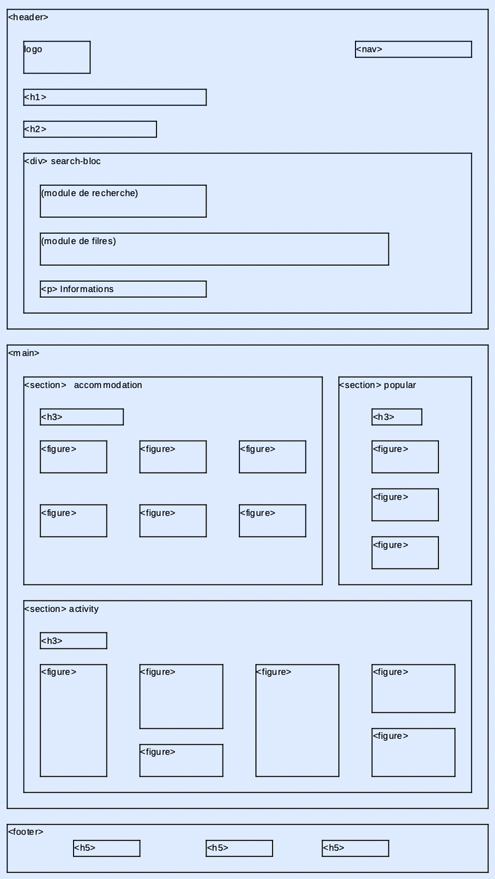
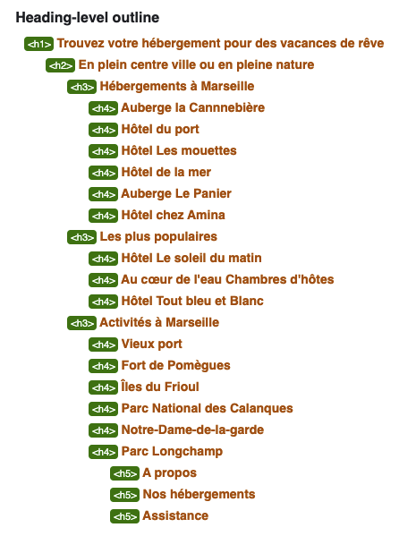
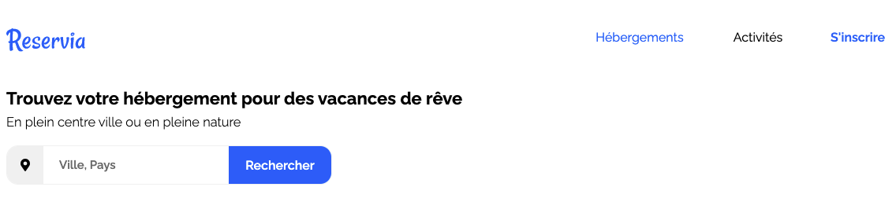
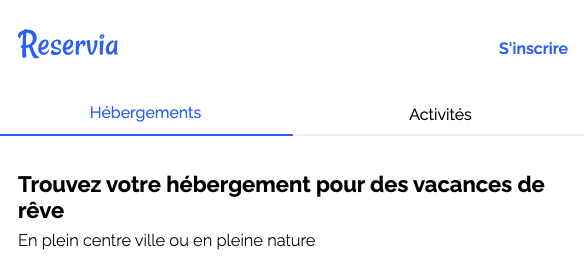
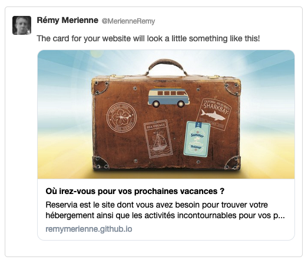
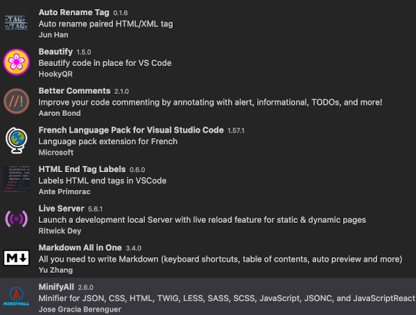

# 1. Reservia

Projet N°2 du parcours _Développeur Front-End_ [OpenClassrooms](https://openclassrooms.com/fr/).

RESERVIA est un site de recherche d'hébergements et d'activités pour planifier ses vacances dans la ville de son choix.

Lien vers le site : 
[*Reservia*](https://remymerienne.github.io/RemyMerienne_2_18052021/)

***


## 1.1. Transformer une maquette en site Web avec HTML et CSS

- Intégration de contenu en fonction d'une maquette
- Implémentation d'une interface responsive

L'intégration du site a été réalisée en HTML5 et CSS3, sans Framework.  
La maquette version _Desktop_ est disponible [ici](supply/_img_README/desktop.png) et la version _Mobile_ [ici](supply/_img_README/phone.png)

***

- [1. Reservia](#1-reservia)
  - [1.1. Transformer une maquette en site Web avec HTML et CSS](#11-transformer-une-maquette-en-site-web-avec-html-et-css)
    - [1.1.1. Découpage sémantique du site](#111-découpage-sémantique-du-site)
    - [1.1.2. Gestion de versions et Workflow](#112-gestion-de-versions-et-workflow)
    - [1.1.3. Breakpoints](#113-breakpoints)
    - [1.1.4. Mise en page](#114-mise-en-page)
    - [1.1.5. Optimisation](#115-optimisation)
      - [1.1.5.1. Traitement des dépendances](#1151-traitement-des-dépendances)
      - [1.1.5.2. Pré-chargement](#1152-pré-chargement)
      - [1.1.5.3. Traitement des images](#1153-traitement-des-images)
    - [1.1.6. SEO](#116-seo)
      - [1.1.6.1. Favicon](#1161-favicon)
      - [1.1.6.2. Open Graph](#1162-open-graph)
      - [1.1.6.3. Twitter Card](#1163-twitter-card)
    - [1.1.7. Matériel utilisé](#117-matériel-utilisé)
      - [1.1.7.1. Editeur de code](#1171-editeur-de-code)
      - [1.1.7.2. Navigateurs](#1172-navigateurs)
      - [1.1.7.3. Edition et retouche d'images](#1173-edition-et-retouche-dimages)

***

### 1.1.1. Découpage sémantique du site

Le site a été decoupé de la façon suivante :



Intégrer le bloc de recherche _search-bloc_ au `<header>` permet de bien dissocier notre contenu principal `<main>` qui se compose de trois `<section>` détaillant le résultat de la recherche effectuée par _l'utilisateur_.

Grâce à l'outil de vérification de code HTML du [W3C](https://validator.w3.org/), nous pouvons nous assurer de la cohérence de la structure du site et des titres :



***

### 1.1.2. Gestion de versions et Workflow

Les versions du site effectuées grâce à **_GIT_** sont hébergées sur [**_GitHub_**](https://github.com/).

Le plugin **_Git Flow_** a facilité le découpage des tâches grâce à son modèle de branches.  
Une branche de développement particulère (_`feature`_) a été dédiée à chaque étape et fonctionnalité du site à partir de la _Time line_ `develop`.  
Après validation, une version taggée `v0.0.0` est publiée sur la branche `main` et mise en ligne (_`release`_).

L'interface graphique [GitKraken](https://www.gitkraken.com/) a facilité l'utilisation de **_GIT_** et **_Git Flow_**.

***

### 1.1.3. Breakpoints


La résolution d'écran la plus utilisée en France (à hauteur de 12.11% tout type d'appareil confondu ces douze derniers mois) est de 1920x1080 (_source_ [_statcounter GlobalStat_](https://gs.statcounter.com/screen-resolution-stats/all/france)).  
C'est pourquoi la maquette du site a été intégrée sur cette base dans sa version la plus grande.

Vient ensuite la résolution 1366x768 (à 7.48%) qui sera le premier point de rupture.
C'est ensuite le visuel du site qui dictera l'adaptation du site jusqu'à atteindre 375px et respecter la maquette fournie pour l'_IPhone 8_.  
Une adaptation a été prévue pour les écrans de très petites taille comme les _IPhone 5_ de 320px.

_Pour résumer, voici les différents points de ruptures :_

- 1366px
- 1165px
- 768px
- 610px
- 374px

***

### 1.1.4. Mise en page

La méthode **Flexbox** a été choisie pour assurer la disposition et l'adaptabilité des éléménts en fonction de la taille de l'écran _utilisateur_.

Le premier défis était de dissocier le menu dont les éléménts doivent s'inverser et adopter des comportements différents :



Le bloc `nav` en `display: flex;` place ses éléments tout à droite de la page

```css
.nav {
  display: flex;
  align-items: flex-end;
  justify-content: flex-end;
  margin-bottom: 55px;
}
```

Et le logo est positionné en `absolute`

```css
.logo {
  width: 100px;
  position: absolute;
  top: 40px;
}
```

En version mobile :



Les deux liens _Hébergements_ et _Activités_ tenues à l'écart dans une `<div class="menu">` ont pu se positionner ainsi en passant le bloc `nav` par défaut en `flex-direction: row;` à `flex-direction: column-reverse`;

```css
.nav {
  flex-direction: column-reverse;
  align-items: flex-end;
  margin-bottom: 35px;
}
.menu {
  width: 100%;
  margin-top: 45px;
}
```

***

### 1.1.5. Optimisation

#### 1.1.5.1. Traitement des dépendances

Les icônes du site proviennent de la bibliothèque [_Font Awesome_](https://img.shields.io/badge/gimp-5C5543?style=for-the-badge&logo=gimp&logoColor=white) et est hébergée en local afin d'assurer l'affichage même en cas d'indisponibilité du fournisseur.

Le fichier all.css a été nettoyé grâce à l'outil **_Coverage_** de la console de developpement de Google chrome, pour ne garder que le CSS necessaire et l'en-tête comportant la license. Le code restant a été compressé.
Les _webfont_ non utilisées ont été supprimée.

La police _"Raleway"_ provenant de [Google Fonts](https://fonts.google.com/specimen/Raleway) est aussi hébergée en local et seul les graissages 300, 400, 600 et 700 ont été consevés et utilisés.

#### 1.1.5.2. Pré-chargement

Comme préconisé dans la [MDN Web Docs](https://developer.mozilla.org/en-US/docs/Web/HTML/Link_types/preload), le pré-chargement des ressources lourdes et appelées dans une feuille de style externe, permet un gain de temps au chargement et à l'affichage assurant une meilleure expérience utilisateur.

Ce principe a donc été appliqué aux _polices_ **_Font Awesome_** et **_Google_**:

```html
 <!-- Pre-load-fonts -->
  <link rel="preload" href="fonts/raleway-v19-latin-regular.woff2" as="font" type="font/woff2" crossorigin>
  <link rel="preload" href="fonts/raleway-v19-latin-300.woff2" as="font" type="font/woff2" crossorigin>
  <link rel="preload" href="fonts/raleway-v19-latin-600.woff2" as="font" type="font/woff2" crossorigin>
  <link rel="preload" href="fonts/raleway-v19-latin-700.woff2" as="font" type="font/woff2" crossorigin>
  <link rel="preload" href="webfonts/fa-solid-900.woff2" as="font" type="font/woff2" crossorigin>
  <!-- Pre-load-style -->
  <link rel="preload" href="css/style.css" as="style">
  <link rel="preload" href="css/all.css" as="style">
```

#### 1.1.5.3. Traitement des images

Les Images sont redimensionnées avec _Gimp_ pour correspondre au mieux à l'affichage et compressée en mode _lossless_ sur le site [compressor.io](https://compressor.io/).

Pour les images pouvant encore être allégées, une version _Webp_ est mise à disposition des navigateurs compatibles grâce à la balise `<picture>`.

```html
<picture>
  <source type="image/webp" srcset="images/accommodation/hotel-du-port.webp" />
  
</picture>
```

***

### 1.1.6. SEO

#### 1.1.6.1. Favicon

Après avoir créé un icône issu du logo, un jeu de _Favicons_ compatibles tout supports a été géneré sur le site [_realfavicongenerator.net_](https://realfavicongenerator.net/)


Puis le code HTML suivant inséré entre les balises `<head>`:

```html
<!-- Favicon -->
  <link rel="apple-touch-icon" sizes="57x57" href="icons/apple-touch-icon-57x57.png">
  <link rel="apple-touch-icon" sizes="60x60" href="icons/apple-touch-icon-60x60.png">
  <link rel="apple-touch-icon" sizes="72x72" href="icons/apple-touch-icon-72x72.png">
  <link rel="apple-touch-icon" sizes="76x76" href="icons/apple-touch-icon-76x76.png">
  <link rel="apple-touch-icon" sizes="114x114" href="icons/apple-touch-icon-114x114.png">
  <link rel="apple-touch-icon" sizes="120x120" href="icons/apple-touch-icon-120x120.png">
  <link rel="icon" type="image/png" sizes="32x32" href="icons/favicon-32x32.png">
  <link rel="icon" type="image/png" sizes="16x16" href="icons/favicon-16x16.png">
  <link rel="manifest" href="icons/site.webmanifest">
  <link rel="mask-icon" href="icons/safari-pinned-tab.svg" color="#0065fc">
  <link rel="shortcut icon" href="icons/favicon.ico">
  <meta name="msapplication-TileColor" content="#0065fc">
  <meta name="msapplication-config" content="icons/browserconfig.xml">
  <meta name="theme-color" content="#0065fc">
```

Les différents icônes générés sont stockés dans le repertoire `icons`

#### 1.1.6.2. Open Graph

Création de la vignette publicitaire du site apparaissant sur **Facebook** à l'aide de la documentation [developers.facebook.com](https://developers.facebook.com/docs/sharing/webmasters#markup)


Avec le code suivant :

```html
<!-- Open Graph data -->
  <meta property="og:title" content="Où irez-vous pour vos prochaines vacances ?" />
  <meta property="og:type" content="website" />
  <meta property="og:url" content="https://remymerienne.github.io/RemyMerienne_2_18052021" />
  <meta property="og:locale" content="fr_FR" />
  <meta property="og:image"
    content="https://remymerienne.github.io/RemyMerienne_2_18052021/supply/_img_OG-TC/valise-open-graph.jpg" />
  <meta property="og:image:type" content="image/jpg" />
  <meta property="og:image:width" content="1060" />
  <meta property="og:image:height" content="1060" />
  <meta property="og:image:alt" content="La valise est prête" />
  <meta property="og:description"
    content="Reservia est le site dont vous avez besoin pour trouver votre hébergement ainsi que les activités incontournables pour vos prochaines vacances" />
```

#### 1.1.6.3. Twitter Card

Création de la vignette publicitaire du site apparaissant sur **Twitter** avec de la documentation [developer.twitter.com](https://developer.twitter.com/en/docs/twitter-for-websites/cards/overview/summary-card-with-large-image)



Avec le code suivant :

```html
 <!-- Twitter Card data -->
  <meta name="twitter:card" content="summary_large_image">
  <meta name="twitter:site" content="https://remymerienne.github.io/RemyMerienne_2_18052021">
  <meta name="twitter:title" content="Où irez-vous pour vos prochaines vacances ?">
  <meta name="twitter:description"
    content="Reservia est le site dont vous avez besoin pour trouver votre hébergement ainsi que les activités incontournables pour vos prochaines vacances">
  <meta name="twitter:creator" content="@pixabay-stux">
  <meta name="twitter:image"
    content="https://remymerienne.github.io/RemyMerienne_2_18052021/supply/_img_OG-TC/valise-t-c.jpg">
```

***

### 1.1.7. Matériel utilisé

#### 1.1.7.1. Editeur de code

- [**_Visual Studio Code_**](https://code.visualstudio.com/)

Avec les plugins suivant :



#### 1.1.7.2. Navigateurs

- [**_Google Chrome_**](https://www.google.fr/chrome/)

- [**_Firefox_**](https://www.mozilla.org/fr/firefox/new/)

_Avec leurs outils de développements respectifs_

#### 1.1.7.3. Edition et retouche d'images

- [**_Gimp_**](https://www.gimp.org/downloads/)

***
